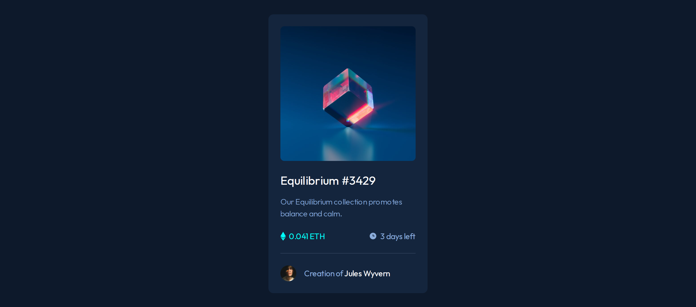

# Frontend Mentor - NFT preview card component solution

This is a solution to the [NFT preview card component challenge on Frontend Mentor](https://www.frontendmentor.io/challenges/nft-preview-card-component-SbdUL_w0U).

## Table of contents

- [Overview](#overview)
  - [The challenge](#the-challenge)
  - [Screenshot](#screenshot)
  - [Links](#links)
- [My process](#my-process)
  - [Built with](#built-with)
  - [What I learned](#what-i-learned)
  - [Useful resources](#useful-resources)
- [Author](#author)

## Overview

### The challenge

Users should be able to:

- View the optimal layout depending on their device's screen size
- See hover states for interactive elements

### Screenshot

Desktop View



Mobile View


### Links

- Solution URL: [Repository](https://github.com/kushagarwal11ag/nft-preview)
- Live Site URL: [Website](https://kushagarwal11ag.github.io/nft-preview)

## My process

### Built with

- Semantic HTML5 markup
- CSS custom properties
- Flexbox
- Mobile-first workflow

### What I learned

1. Learnt to efficiently use code such that it does not get repeated.
2. Using 'rem' units throughout the website to get it more responsive and easily change root element unit to change all the sizes from media queries.
```css
@media only screen and (max-width: 23.5rem) {
	html {
		font-size: 12px;
	}
}
```
3. Learnt to add overlay effect on existing element.
```css
.overlay {
  position: absolute;
}
```
4. Learnt to add images over elements.
This code takes the image and centers it perfectly.
```css
.main-img:hover::after {
	content: url(images/icon-view.svg);
	position: absolute;
	left: 50%;
	top: 50%;
	transform: translate(-50%, -50%);
}
```

### Useful resources

- [Overlay](https://www.w3schools.com/howto/howto_css_image_overlay.asp) - This tutorial helped me for adding overlay effect to my element.
- [Element centering](https://stackoverflow.com/questions/1776915/how-can-i-center-an-absolutely-positioned-element-in-a-div) - The solution provided helped me to center my image on top of an element, taking into account the width and height of the image itself.

## Author

- Frontend Mentor - [@kushagarwal11ag](https://www.frontendmentor.io/profile/kushagarwal11ag)